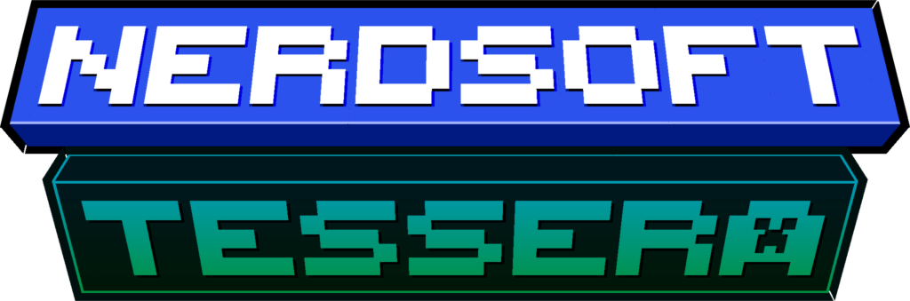
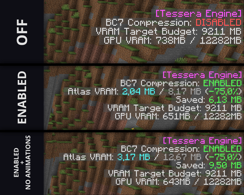
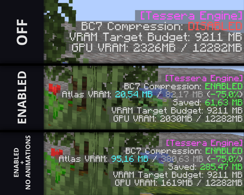

<div align="center">

# 

[](https://neoforged.net/)
[](https://modrinth.com/mod/tesseras)
[](https://www.curseforge.com/minecraft/mc-mods/tessera)
[](#license)

**A GPU-first VRAM optimization engine for NeoForge 1.21.1**

**Recompresses texture atlases to BC7 on the fly, with a native Rust/C++ bridge and safe automatic fallback.**
</div>

---

## Overview

**Tessera** intercepts Minecraft's texture atlas generation pipeline and recompresses eligible atlases on-the-fly into
GPU-native **BC7** format, using a high-performance Rust/C++ native bridge with SIMD-accelerated encoding. The result is
a dramatically lower VRAM footprint with no perceptible visual degradation — especially valuable on low-end and
integrated-GPU hardware running texture-heavy modpacks. Everything is built around a single Mixin interception point
(`SpriteLoader`) and a self-contained native bridge, so the mod stays focused and easy to reason about or extend.

> Currently in **early development** — the compression pipeline, Auto-Budget Engine, and dual-OS native bridge are
> implemented and stable, but tuning and platform coverage are still evolving. Feedback and bug reports are very welcome.

## Features

### 🧩 BC7 Compression

- Hooks Minecraft's `SpriteLoader` atlas stitching (`SpriteLoaderMixin`) to recompress qualifying atlases into
  GPU-native BC7 block-compressed textures instead of raw RGBA.
- Compression runs through a dedicated `CompressionPipeline`, backed by a native Rust/C++ bridge with SIMD vectorization
  for high-throughput encoding.
- `NativeFamilyDetector` and `AtlasCache` avoid redundant recompression work across atlas reloads.

### 🧠 Dynamic Auto-Budget Engine

- `VramBudgetEngine` computes a per-atlas VRAM target at runtime instead of applying a fixed global compression ratio,
  balancing memory savings against visual fidelity for each individual atlas.
- No manual tuning required — the engine adapts automatically to the atlases actually present in your instance.

### 🛡️ Dual-OS Native Bridge, Single JAR

- Ships prebuilt native binaries for both **Windows** and **Linux** (x86_64), embedded directly in mod resources under
  `natives/<platform>/`.
- `NativeLibraryLoader` detects the current OS/architecture, extracts the matching binary, and loads it automatically —
  no separate downloads or manual installs.
- If the native bridge fails to load for any reason (unsupported OS/architecture, missing symbols, incompatible GPU),
  Tessera logs a warning and transparently falls back to vanilla RGBA atlas behavior. The mod never hard-crashes due to
  native-layer failures.

### 📊 Real-Time F3 Debug Overlay

- `TesseraDebugOverlay` reports live VRAM savings metrics directly in the debug HUD, so you can see exactly what Tessera
  is doing as you play.

### 🔌 Public Compression Event API

- `TesseraAtlasCompressEvent` exposes a hook for other mods to observe or react to atlas compression, keeping Tessera
  easy to build on top of.

## Benchmarks / Performance Metrics

#### Measured on Vanilla:

<div align="center">



</div>

#### Measured on a heavy modpack (**All The Mods 10**):

<div align="center">



</div>

### Conclusion

- Up to **75% reduction** in texture atlas VRAM footprint.
- **No perceptible visual degradation** — BC7 is a high-quality block compression format designed for near-lossless GPU
  texture storage.
- Savings scale with atlas count and resolution, making the impact most pronounced on large, texture-dense modpacks.

> Benchmarks are workload-dependent. Actual savings vary based on resource pack resolution, installed mods, and atlas
> composition.

## Installation & Requirements

| Requirement | Version                                                |
|-------------|--------------------------------------------------------|
| Minecraft   | `1.21.1`                                               |
| Mod Loader  | [NeoForge](https://neoforged.net/) `21.1.248` or later |
| Java        | `21+`                                                  |
| OS/Arch     | Windows or Linux, `x86_64`                             |

1. Install [NeoForge](https://neoforged.net/) `21.1.248` or later for Minecraft 1.21.1.
2. Download the latest **Tessera** jar from [Modrinth](https://modrinth.com/mod/tessera)
   or [CurseForge](https://www.curseforge.com/minecraft/mc-mods/tessera).
3. Drop the jar into your `mods/` folder.
4. Launch the game — no extra setup, no separate native binary downloads.

> This mod is a **client-side** mod. It has no effect on server behavior and does not need to be installed on dedicated
> servers.

## Configuration & Integration

### Native Bridge

No configuration is required for the native compression bridge — the correct binary for your platform is bundled in the
JAR and loaded automatically on startup. If it can't be loaded, Tessera falls back to vanilla texture behavior with no
action needed on your part.

### Compression Rules

Per-atlas compression behavior is governed by `TesseraConfig` and `TesseraRulesManager`, allowing fine-grained control
over which atlases are eligible for compression.

## Developer & Contributor Guide

Contributions are welcome for **bug reports, benchmarks, and native bridge improvements**.

1. **Bugs & suggestions:** open a [GitHub Issue](https://github.com/NerdSoftOrg/Tessera/issues) with your
   Minecraft/NeoForge/mod version, GPU/OS details, a log if relevant, and steps to reproduce.
2. **Pull requests:** open an issue first to discuss the change before investing time in a PR — this keeps effort
   aligned with where the project is headed, and avoids duplicate work.
3. **Dev environment:** standard NeoForge Gradle userdev setup, managed
   via[Stonecutter](https://github.com/kikugie/stonecutter) for multi-version source management.

### Requirements

- **JDK 21**
- **Gradle 8.x+** (via the included wrapper — no manual install needed)
- **Rust** (stable toolchain) — required only if rebuilding the native bridge
- A C++ toolchain compatible with your target platform — required only if rebuilding the native bridge

### Project Layout

```
native/
  bridge/           # Rust JNI bridge (lib.rs, Cargo.toml)
  vendor/
    bc7enc_rdo/     # Vendored C++ BC7 encoder (tessera_bridge.cpp)
src/main/java/com/nerdsoft/mods/tessera/
  api/              # Public compression event API
  atlas/            # Texture family detection
  cache/            # Atlas compression caching
  client/gui/       # F3 debug overlay
  compress/         # Compression pipeline & GPU BC7 support checks
  config/           # Mod config & compression rules
  jni/              # Native bridge loader & JNI entry points
  mixin/            # SpriteLoader mixin (atlas interception point)
  vram/             # VRAM Auto-Budget Engine
versions/1.21.1/    # Stonecutter version node
```

### Building the Java side

```bash
./gradlew :1.21.1:build
```

This compiles the mod, runs Mixin annotation processing, and produces the mod JAR under `versions/1.21.1/build/libs/`.

### Building the native Rust/C++ bridge

The native bridge lives in `native/bridge` (Rust, JNI entry points) and links against the vendored C++ BC7 encoder in
`native/vendor/bc7enc_rdo`.

**Windows (x86_64):**

```bash
cd native/bridge
cargo build --release
```

**Linux (x86_64), cross-compiled from any host via `cargo-zigbuild`:**

```bash
cd native/bridge
cargo zigbuild --target x86_64-unknown-linux-gnu --release
```

After building, place the resulting binaries into the Java resources tree so they get bundled into the JAR:

```
src/main/resources/natives/
  windows-x86_64/
    tessera_bridge.dll
  linux-x86_64/
    libtessera_bridge.so
```

At runtime, `NativeLibraryLoader` detects the current OS/architecture, extracts the matching binary from resources, and
loads it via `System.load`. If no matching binary is bundled or loading fails for any reason, Tessera automatically
falls back to vanilla behavior — no manual configuration required.

> **Note:** Contributors only need to rebuild the native bridge when modifying `native/bridge` or `native/vendor`. Pure
> Java/Mixin changes only require the Gradle build above.

### Running in a dev environment

```bash
./gradlew :1.21.1:runClient
```

Please be respectful and constructive when opening issues or discussing changes.

## License

Tessera uses a **dual-license model**:

| Content                             | License                                                                                                                              |
|-------------------------------------|--------------------------------------------------------------------------------------------------------------------------------------|
| Source code (Java, Rust, C++)       | [GNU Affero General Public License v3.0 (AGPLv3)](https://www.gnu.org/licenses/agpl-3.0.html) — see [`LICENSE-AGPL`](./LICENSE-AGPL) |
| Artwork, logos, and branding assets | [CC BY-NC-SA 4.0](https://creativecommons.org/licenses/by-nc-sa/4.0/) — see [`LICENSE-CC`](./LICENSE-CC)                             |

In short, for the **source code**:

- **Share & Adapt** — you're free to study, modify, and redistribute it under AGPLv3 terms.
- **Network copyleft** — if you run a modified version as a network service, you must make your modifications' source
  available to users of that service.

And for **artwork, logos, and branding**:

- **Attribution** — credit NerdSoft and link back to the original.
- **NonCommercial** — no selling the assets or derivatives, or using them commercially, without permission.
- **ShareAlike** — if you remix or build on them, your version must carry the same license.

See [`LICENSE`](./LICENSE) for the full summary and links to both license texts, or open an issue if you'd like to
discuss usage outside these terms.

---

<div align="center">


Made by **[NerdSoft](https://github.com/NerdSoftOrg)**

[](https://modrinth.com/mod/tesseras)
[](https://www.curseforge.com/minecraft/mc-mods/tessera)
[](https://github.com/NerdSoftOrg/Tessera/issues)

</div>
